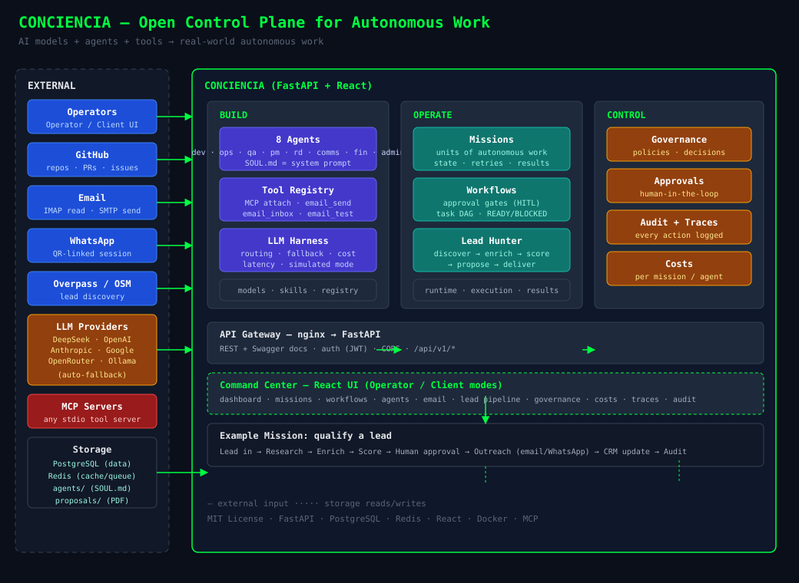

<div align="center">

# 🧠 Conciencia

### The Open Control Plane for Autonomous Work

**AI agents are easy to build. Running them reliably in production is the hard part.**

[](CHANGELOG.md)
[](LICENSE)
[]()
[]()

[▶ Try the live demo](https://mc.46.62.196.151.sslip.io) · [Website](https://conciencia-software.vercel.app) · [Docs](docs/ARCHITECTURE.md) · [Contributing](CONTRIBUTING.md)

</div>

---

## What is Conciencia?

Conciencia is the **layer between AI models + agents + tools and real-world
autonomous work**. It gives you the control plane to run agents in production:

- **BUILD** — agents, tools, models, skills, MCP servers
- **OPERATE** — missions, workflows, execution, observability
- **CONTROL** — governance, approvals, audit, costs, policies

One central abstraction: the **MISSION** — a unit of autonomous work with
agents, tools, state, approvals and a full audit trail.

> Not another chatbot. Not another agent framework. Not another workflow
> builder. Conciencia is **infrastructure for reliable autonomous systems**.

---

## Why Conciencia?

| Problem | Conciencia |
|---|---|
| Agents are demo-only | **Missions** with real state, retries and execution |
| No human control | **Approval gates** — human-in-the-loop by design |
| No accountability | **Full audit trail** — every action, decision and cost |
| Fragile LLM chains | **LLM Harness** — multi-provider with automatic fallback |
| Silos everywhere | **MCP native** — attach any tool/server, email included |
| No governance | **Policies, roles, traceability, cost tracking** |

---

## 🚀 Quick Start (3 commands)

```bash
git clone https://github.com/juanesscobar/mission-control.git
cd mission-control
docker compose up -d --build
```

Then open `http://localhost` — login with the admin seeded from
`LOCAL_ADMIN_PASSWORD` (see `.env.example`).

**Prefer local dev without Docker?** See [Quickstart local](docs/DEVELOPMENT.md).

> 🧪 No API keys? The LLM Harness runs in **simulated mode** so you can explore
> the whole control plane without spending a cent.

---

## 🎬 The flagship demo: Autonomous Lead Qualification

```
Lead enters system        →  Lead Hunter (Overpass/OSM)
      ↓
Research agent            →  company enrichment (website → email/tel)
      ↓
AI enrichment & scoring   →  LLM Harness (0-100 score, sector, questions)
      ↓
Human approval           →  review the qualified prospect
      ↓
Outreach agent           →  proposal PDF + email via MCP (SMTP/IMAP)
      ↓
CRM update               →  kanban, notes, events
      ↓
Audit trail              →  everything logged, traced and costed
```

The whole pipeline runs on the live demo — from raw lead to sent proposal,
with agents, tools, models, approvals, logs, cost and audit visible.

---

## Core concepts

- **Missions** — units of autonomous work (a lead to qualify, a feature to ship)
- **Agents** — 8 built-in roles (dev, ops, qa, pm, rd, comms, fin, admin), each
  with its own `SOUL.md` identity used as the system prompt
- **Workflows** — multi-step flows with approval gates and DAG task dependencies
- **LLM Harness** — multi-provider routing (DeepSeek, OpenAI, Anthropic, Google,
  OpenRouter, Ollama) with fallback, cost tracking and latency metrics
- **MCP** — attach external tool servers; built-in email server exposes
  `email_send`, `email_inbox`, `email_test` to agents
- **Control plane** — governance, policies, decisions, audit log, traces, costs
- **Command center** — Operator mode (full control) vs Client mode (results only)

---

## Architecture

<div align="center">



</div>

```
CONCIENCIA
   │
┌──┼─────────┬────────────┐
BUILD      OPERATE      CONTROL
Agents     Missions    Governance
Tools      Workflows   Approvals
Models     Runtime     Audit
Skills     Execution   Observability
```

**Stack:** FastAPI · PostgreSQL · Redis · React + Vite + Tailwind · Docker · MCP
(stdio) · nginx (production entrypoint).

Full details: [docs/ARCHITECTURE.md](docs/ARCHITECTURE.md)

---

## ✨ Features

- 🤖 **8 agents** with `SOUL.md` identities + agent registry in DB
- 🧠 **LLM Harness** — multimodal, fallback, cost & latency tracking
- ⚙️ **Workflows + approval gates** — human-in-the-loop execution
- 🔀 **Task DAG** — dependencies with READY/ASSIGNED/BLOCKED states
- 📬 **Email module** — multi-provider (Gmail/Outlook/generic), IMAP read +
  SMTP send, encrypted credentials (Fernet), exposed as MCP tools
- 🔌 **MCP Tool Registry** — attach any stdio MCP server
- 💰 **Lead Hunter** — Overpass/OSM discovery, dedupe, AI enrichment, scoring,
  proposals in PDF, delivery by email/WhatsApp
- 📊 **Governance** — projects, sprints, metrics, reports, decisions
- 👤 **User memory** — persistent per-operator context
- 🔒 **Security by default** — nginx-only exposure, internal Postgres/Redis,
  encrypted secrets, full audit

---

## 📸 Screenshots

<!-- TODO: add real screenshots (login, dashboard, missions, email, lead hunter) -->
_Coming soon — see the live demo meanwhile: https://mc.46.62.196.151.sslip.io_

---

## 🗺️ Roadmap

- **v0.1** — current: control plane, missions, workflows, MCP, email, lead pipeline
- **v0.2** — agent marketplace, model/tool registry UI, more MCP servers
- **v0.3** — Conciencia Cloud (managed), enterprise integrations, teams

See [CHANGELOG.md](CHANGELOG.md) and open issues for details.

---

## 🤝 Community & Contributing

- [Contributing guide](CONTRIBUTING.md) — from 30-min good-first-issues to deep integrations
- [Issue templates](.github/ISSUE_TEMPLATE/) — bug, feature, docs
- [Security policy](SECURITY.md) — private vulnerability reporting
- Discussions, issues and PRs are welcome — we reply fast.

---

## 📄 License

[MIT](LICENSE) © 2026 Juan Andrés Escobar Vega

---

<div align="center">

*

</div>
